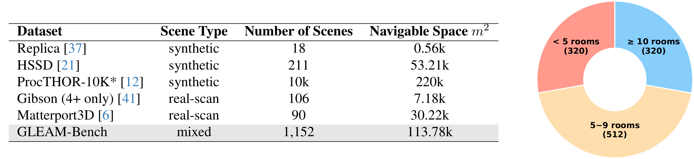

# GLEAM-Bench
<!-- **[Project Page](https://xiao-chen.tech/gleam/) / [arXiv]() / [Code (GLEAM)](https://github.com/zjwzcx/GLEAM)** -->

<div id="top" align="center">
[]()
[](https://github.com/zjwzcx/GLEAM)
[](https://xiao-chen.tech/gleam/)
</div>


<!-- ## Overview -->

We introduce GLEAM-Bench, a benchmark for generalizable exploration for active mapping in complex 3D indoor scenes.
These scene meshes are characterized by watertight geometry, diverse floorplan (≥10 types), and complex interconnectivity. We unify and refine multi-source datasets through manual filtering, geometric repair, and task-oriented preprocessing. 
To simulate the exploration process, we connect our dataset with NVIDIA Isaac Gym, enabling parallel sensory data simulation and online policy training.
<!-- , achieving 150 FPS even trained on 512 complex scenes. -->

## Download
We provide all the preprocessed data used in our work, including mesh files and ground-truth surface points. We recommend users download the data from our provided Google Drive link [[HERE](https://drive.google.com/drive/folders/1UKSSiG6x7xVq-r1yIfeW_KXhA-C3OqBO?usp=sharing)].

The directory structure should be as follows.

```
data_gleam
├── stage1_512
│   ├── gt
│   ├── obj
│   ├── urdf
├── stage2_512
│   ├── gt
│   ├── obj
│   ├── urdf
```

> [!NOTE]
> We integrates and distributes ground-truth data from 1,024 training scenes across two stages, maintaining consistency with GLEAM's training configuration.
> 
> To expedite the training process, we implemented scene compression measures including the consolidation of entire scenes into unified mesh layers and the removal of textures. In line with our commitment to scalability and community support, full access to the original uncompressed datasets has been openly provided:


The raw scene meshs with textures and object-level layers (interactive) are also provided:
```
raw_data_gleam
├── procthor_12-room_64
│   ├── gt
│   ├── obj
├── gibson_96
│   ├── gt
│   ├── obj
├── hssd_32
│   ├── gt
│   ├── obj
...
```


## Citation

The GLEAM-Bench dataset comes from the GLEAM paper:

- **arXiv**: TODO

- **Code**: https://github.com/zjwzcx/GLEAM

- **BibTex**:
```bibtex
TODO
```


If you find our dataset/benchmark useful, please also cite them:
```bibtex
@inproceedings{procthor,
  author={Matt Deitke and Eli VanderBilt and Alvaro Herrasti and
          Luca Weihs and Jordi Salvador and Kiana Ehsani and
          Winson Han and Eric Kolve and Ali Farhadi and
          Aniruddha Kembhavi and Roozbeh Mottaghi},
  title={{ProcTHOR: Large-Scale Embodied AI Using Procedural Generation}},
  booktitle={NeurIPS},
  year={2022},
  note={Outstanding Paper Award}
}
```
```bibtex
@inproceedings{xiazamirhe2018gibsonenv,
  title={Gibson {Env}: real-world perception for embodied agents},
  author={Xia, Fei and R. Zamir, Amir and He, Zhi-Yang and Sax, Alexander and Malik, Jitendra and Savarese, Silvio},
  booktitle={Computer Vision and Pattern Recognition (CVPR), 2018 IEEE Conference on},
  year={2018},
  organization={IEEE}
}
```
```bibtex
@article{khanna2023hssd,
    author={{Khanna*}, Mukul and {Mao*}, Yongsen and Jiang, Hanxiao and Haresh, Sanjay and Shacklett, Brennan and Batra, Dhruv and Clegg, Alexander and Undersander, Eric and Chang, Angel X. and Savva, Manolis},
    title={{Habitat Synthetic Scenes Dataset (HSSD-200): An Analysis of 3D Scene Scale and Realism Tradeoffs for ObjectGoal Navigation}},
    journal={arXiv preprint},
    year={2023},
    eprint={2306.11290},
    archivePrefix={arXiv},
    primaryClass={cs.CV}
}
```
```bibtex
@article{Matterport3D,
  title={Matterport3D: Learning from RGB-D Data in Indoor Environments},
  author={Chang, Angel and Dai, Angela and Funkhouser, Thomas and Halber, Maciej and Niessner, Matthias and Savva, Manolis and Song, Shuran and Zeng, Andy and Zhang, Yinda},
  journal={International Conference on 3D Vision (3DV)},
  year={2017}
}
```
